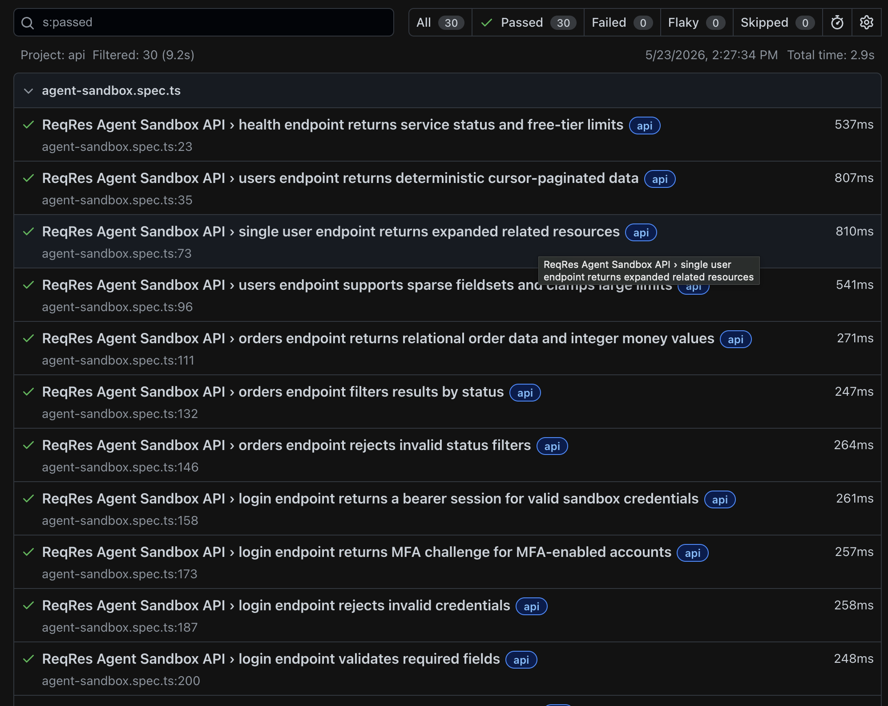
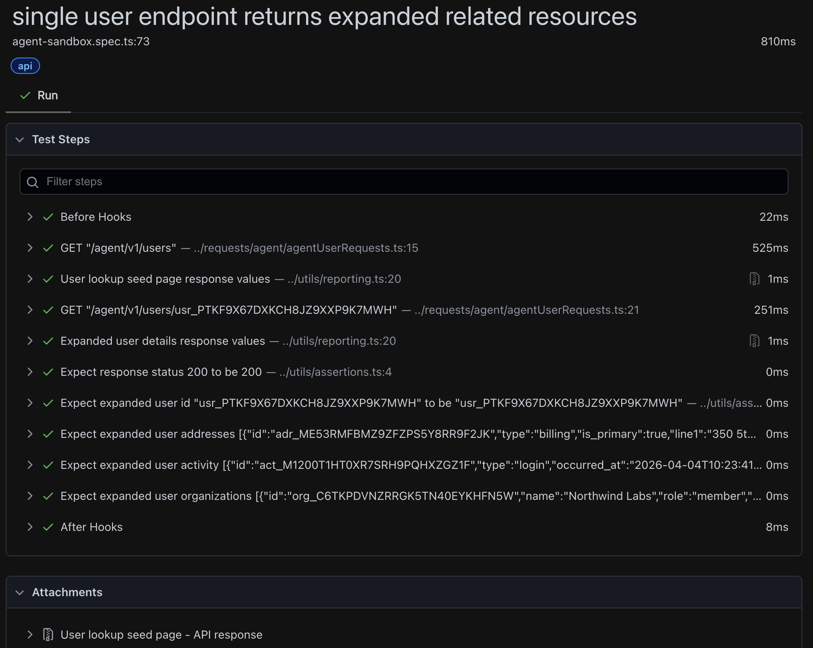

# Playwright API Automation Framework - ReqRes

[](https://playwright.dev/)
[](https://www.typescriptlang.org/)
[](https://nodejs.org/)
[](https://reqres.in/)
[](#test-coverage)
[](#reporting-and-debugging)

An API automation framework built with Playwright Test and TypeScript for validating ReqRes endpoints.

The framework covers both currently useful ReqRes API surfaces:

- **Agent Sandbox (`/agent/v1/*`)**: open endpoints that can run without credentials.
- **Legacy API (`/api/*`)**: classic ReqRes endpoints that require an `x-api-key` header.

## Project Preview





## Tech Stack

- Playwright Test
- TypeScript
- Node.js
- dotenv

## Prerequisites

- Node.js 18 or newer
- npm
- Optional: a ReqRes API key for `/api/*` tests

## Installation

```bash
npm install
cp .env.example .env
```

## Environment Configuration

Update `.env` with your local values:

```bash
REQRES_BASE_URL=https://reqres.in
REQRES_API_KEY=your_reqres_api_key
REQRES_ENV=prod
```

`REQRES_API_KEY` is optional for the Agent Sandbox tests. Tests that call `/api/*` are skipped automatically until the key is available.

## Test Coverage

| # | Test Case | Spec File | Description |
|---|---|---|---|
| TC1 | Health Check | `tests/agent-sandbox.spec.ts` | Verify `/agent/v1/health` returns healthy service status, version, and rate-limit metadata |
| TC2 | List Users with Cursor Pagination | `tests/agent-sandbox.spec.ts` | Fetch sandbox users with `seed` and `limit`, validate pagination metadata, then request the next cursor |
| TC3 | Get Expanded User Details | `tests/agent-sandbox.spec.ts` | Fetch one user and validate expanded `addresses`, `activity`, and `organizations` resources |
| TC4 | Sparse Users Fieldset | `tests/agent-sandbox.spec.ts` | Fetch users with `fields=id,email`, validate sparse response shape, and verify large limits are clamped |
| TC5 | List Orders | `tests/agent-sandbox.spec.ts` | Validate relational order data, customer references, line items, and integer money fields |
| TC6 | Filter Orders by Status | `tests/agent-sandbox.spec.ts` | Fetch refunded orders and verify every returned item matches the requested status |
| TC7 | Invalid Order Status Filter | `tests/agent-sandbox.spec.ts` | Send unsupported order status and verify `400` validation response |
| TC8 | Sandbox Login with Valid Credentials | `tests/agent-sandbox.spec.ts` | Submit valid sandbox login payload and verify bearer session token details |
| TC9 | Sandbox Login with MFA Account | `tests/agent-sandbox.spec.ts` | Submit MFA-enabled email and verify challenge token, available methods, and next-step metadata |
| TC10 | Sandbox Login with Invalid Credentials | `tests/agent-sandbox.spec.ts` | Submit invalid credentials and verify `401` error plus remaining-attempts metadata |
| TC11 | Sandbox Login Missing Password | `tests/agent-sandbox.spec.ts` | Submit incomplete login payload and verify required-field validation response |
| TC12 | Invalid Sandbox User ID | `tests/agent-sandbox.spec.ts` | Request a malformed user ID and verify `400` validation response |
| TC13 | Scenario Catalogue | `tests/agent-sandbox.spec.ts` | Fetch available sandbox failure scenarios and verify key free-tier scenarios are listed |
| TC14 | Validation Error Scenario | `tests/agent-sandbox.spec.ts` | Call intentional validation scenario and verify error response plus sandbox intentional header |
| TC15 | Malformed JSON Scenario | `tests/agent-sandbox.spec.ts` | Call intentional malformed JSON scenario and verify invalid response body handling |
| TC16 | List Legacy Users | `tests/legacy-users.spec.ts` | Fetch `/api/users` with pagination and validate user list metadata and fields |
| TC17 | Get Legacy User by ID | `tests/legacy-users.spec.ts` | Fetch `/api/users/2` and verify the returned user ID and email |
| TC18 | Unknown Legacy User | `tests/legacy-users.spec.ts` | Request `/api/users/23` and verify not-found response |
| TC19 | Create Legacy User | `tests/legacy-users.spec.ts` | Create demo user and verify response contains submitted payload, generated ID, and creation timestamp |
| TC20 | Update Legacy User with PUT | `tests/legacy-users.spec.ts` | Fully update demo user and verify updated payload plus update timestamp |
| TC21 | Update Legacy User with PATCH | `tests/legacy-users.spec.ts` | Partially update demo user and verify updated field plus update timestamp |
| TC22 | Delete Legacy User | `tests/legacy-users.spec.ts` | Delete demo user and verify `204` response with empty body |
| TC23 | List Unknown Resources | `tests/legacy-users.spec.ts` | Fetch `/api/unknown` with pagination and validate resource metadata and fields |
| TC24 | Get Unknown Resource by ID | `tests/legacy-users.spec.ts` | Fetch `/api/unknown/2` and verify returned resource ID and color format |
| TC25 | Unknown Resource Not Found | `tests/legacy-users.spec.ts` | Request `/api/unknown/23` and verify not-found response |
| TC26 | Register User with Valid Credentials | `tests/legacy-users.spec.ts` | Register demo user and verify returned ID and token |
| TC27 | Register User Missing Password | `tests/legacy-users.spec.ts` | Submit registration payload without password and verify error response |
| TC28 | Login with Valid Credentials | `tests/legacy-users.spec.ts` | Login demo user and verify token is returned |
| TC29 | Login Missing Password | `tests/legacy-users.spec.ts` | Submit login payload without password and verify error response |
| TC30 | Logout User | `tests/legacy-users.spec.ts` | Call logout endpoint and verify successful response body |

`TC1` to `TC15` run without credentials. `TC16` to `TC30` require `REQRES_API_KEY` and are skipped automatically when the key is not configured.

## CRUD Coverage

The framework includes CRUD-style validation for the legacy ReqRes user API. ReqRes is a demo API, so mutation responses are validated, but created or updated data is not persisted permanently.

| CRUD Operation | HTTP Method | Endpoint | Test Case | Validation |
|---|---|---|---|---|
| Create | `POST` | `/api/users` | TC19 | Verify `201`, submitted `name` and `job`, generated `id`, and `createdAt` timestamp |
| Read | `GET` | `/api/users` | TC16 | Verify `200`, pagination metadata, list size, and user field structure |
| Read | `GET` | `/api/users/2` | TC17 | Verify `200`, returned user ID, and email format |
| Read - Negative | `GET` | `/api/users/23` | TC18 | Verify unknown user returns `404` |
| Update | `PUT` | `/api/users/2` | TC20 | Verify `200`, updated payload, and `updatedAt` timestamp |
| Update | `PATCH` | `/api/users/2` | TC21 | Verify `200`, partially updated payload, and `updatedAt` timestamp |
| Delete | `DELETE` | `/api/users/2` | TC22 | Verify `204` and empty response body |

## Running Tests

Run the full suite:

```bash
npm test
```

Run TypeScript validation:

```bash
npm run lint
```

Open the HTML report:

```bash
npm run report
```

Run a single spec:

```bash
npx playwright test tests/agent-sandbox.spec.ts
```

Run tests by title:

```bash
npx playwright test -g "orders endpoint"
```

## Project Structure

```text
.
├── playwright.config.ts       Playwright configuration
├── requests/
│   ├── agent/                 Reusable Agent Sandbox request methods
│   └── legacy/                Reusable legacy ReqRes request methods
├── tests/
│   ├── agent-sandbox.spec.ts  Open ReqRes Agent Sandbox assertions and flows
│   └── legacy-users.spec.ts   API-key protected ReqRes assertions and flows
├── utils/
│   └── env.ts                 Environment and header helpers
├── .env.example               Environment template
├── package.json               npm scripts and dependencies
└── tsconfig.json              TypeScript configuration
```

## Reporting and Debugging

The framework attaches API response values to the Playwright HTML report. Each test includes named report steps such as `Legacy login success response values` or `Orders list response values`.

Each attachment includes:

- response status
- response headers
- parsed JSON body, or raw text for malformed/non-JSON responses

Assertions also use custom report messages with actual and expected values, for example:

```text
Expect response status 200 to be 200
Expect legacy user email "janet.weaver@reqres.in" to contain "@"
Expect users page data length 3 to be 3
```

Playwright stores test artifacts in:

- `playwright-report/`
- `test-results/`

Traces are retained on failure and can be inspected with:

```bash
npx playwright show-trace path/to/trace.zip
```

## CI Notes

For CI execution:

- Store `REQRES_API_KEY` as a protected secret.
- Avoid running high-frequency schedules against public endpoints.
- Keep retries enabled for transient network failures.
- Review ReqRes rate limits before increasing parallelism.

## References

- [ReqRes API docs](https://reqres.in/docs)
- [ReqRes OpenAPI specification](https://reqres.in/openapi.json)
- [Playwright API testing](https://playwright.dev/docs/api-testing)
